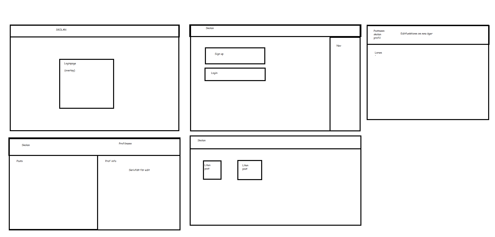
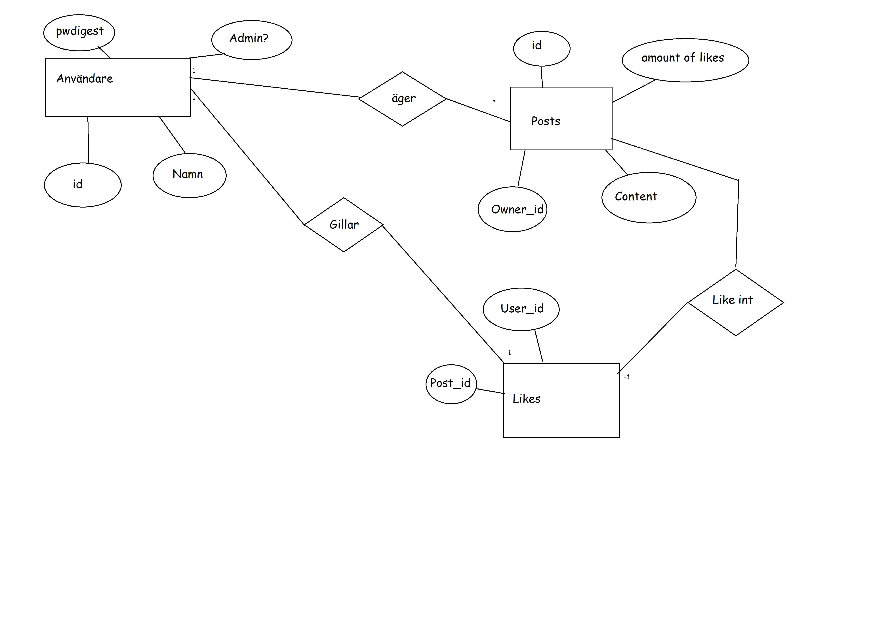

# Projektplan

## 1. Projektbeskrivning (Beskriv vad sidan ska kunna göra).
Ett forum där elever kan posta länkar/texter som de vill ha feedback på.
Elever ska kunna skapa konton och göra posts med saker i som de sedan kan redigera om de vill. 
Det ska även finnas läraroller där lärare kan fungera som admins
Den ska även ha en spara-funktion där man kan spara andras post etc.
## 2. Vyer (visa bildskisser på dina sidor).

## 3. Databas med ER-diagram (Bild på ER-diagram).

## 4. Arkitektur (Beskriv filer och mappar - vad gör/innehåller de?).
fail: dymiska felmeddelanden och en timad tillbaka länk för för många loginförsök
index: startsidan
sucess: en dynamisk sucesssida som visar vad som gått bra
Mappar:  
    posts: här finns sidan där alla posts visas och där man kan redigera sin inlägg
        index: här visas alla inlägg
        edit: här kan man själv och admins redigera inläggen
    users: här finns användarspecifika slim filer
        index: din egen profilsida
        show: andra personers profilsida
    
app.rb: här finns alla routes
model.rb: här finns funktioner
följer mvc

