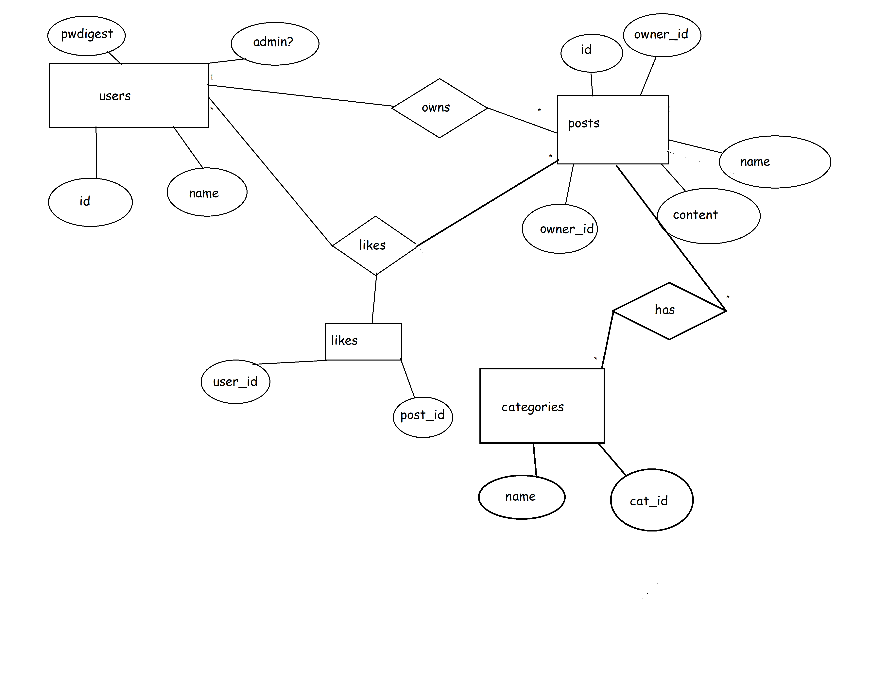

# Projektplan

## 1. Projektbeskrivning (Beskriv vad sidan ska kunna göra).
Ett forum där elever kan posta länkar/texter som de vill ha feedback på.
Elever ska kunna skapa konton och göra posts med saker i som de sedan kan redigera om de vill. 
Det ska även finnas läraroller där lärare kan fungera som admins
Den ska även ha en spara-funktion där man kan spara andras post etc.
## 2. Vyer (visa bildskisser på dina sidor).

## 3. Databas med ER-diagram (Bild på ER-diagram).

## 4. Arkitektur (Beskriv filer och mappar - vad gör/innehåller de?).

